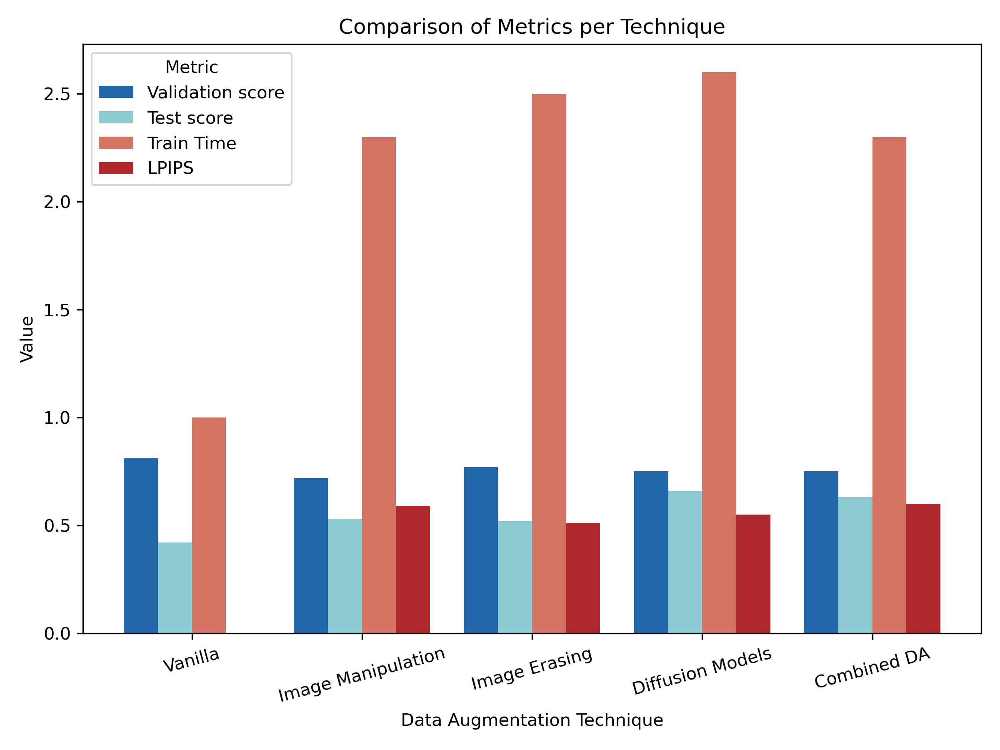

# Effective Waste Classification through Data Augmentation

## Overview
This repository contains the implementation of our work titled "Effective Waste Classification through Data Augmentation," which explores the impact of various Data Augmentation (DA) techniques, including Image Manipulation, Image Erasing, and Diffusion Models on waste classification. We utilize DenseNet-121 to analyze performance improvements, generalization, image fidelity, and computational costs. Our study introduces a structured framework for hyperparameter tuning of DA methods and provides insights into the strategic selection of DA techniques based on their inherent trade-offs.

## Key Findings
- **Enhanced Model Performance**: Our adaptive framework significantly improves model performance through balanced augmentation approaches.
- **State-of-the-Art Techniques**: Diffusion models, which are currently state-of-the-art, substantially enhance performance and generalization, despite their higher computational cost.
- **Trade-offs in Data Augmentation**: We discuss the trade-offs between different DA techniques, particularly focusing on the balance between performance enhancement and computational expenses.
- **Generalization Across Datasets**: The study highlights the importance of considering generalization to different datasets when evaluating augmentation methods.
- **Iterative pipeline for Data Augmentation**: We present a framework of iterating through multiple cycles of generation, evaluation through quantitative metrics such as KL divergence and adjustment,  to refine the augmentation strategy leading to a more effective and adaptable dataset for downstream tasks.

## Results

### Overall results acorss pipelines
| DA Technique            | RealWaste(Val) | TrashNet(Test) |
|-------------------------|-----------|----------|
| DenseNet-121 (DN)       | 81%       | 42%      |
| DN + Image Manipulation | 72%       | 53%      |
| DN + Image Erasing      | 77%       | 52%      |
| DN + Diffusion Models   | 75%       | 66%      |
| DN + Combined DA        | 75%       | 63%      |

### Metrics per Technique
| DA Technique            | Creation    | Train | GG*  | LPIPS |
|-------------------------|-------------|-------|------|-------|
| Image Manipulation      | ~ minutes   | 2.3   | 19%  | 0.59  |
| Image Erasing           | ~ minutes   | 2.5   | 15%  | 0.51  |
| Diffusion Models        | ~ days      | 2.6   | 9%   | 0.55  |
| Combined DA             | -           | 2.3   | 13%  | 0.60  |

(Note: GG* stands for Generalization Gap and Train is the ratio of the total training time between the baseline model and the current model)

### Table 4: F1 Scores in Realwaste[Validation] per Category
| DA Technique            | Cardboard | Glass | Metal | Paper | Plastic | Trash |
|-------------------------|-----------|-------|-------|-------|---------|-------|
| DenseNet-121 (DN)       | 79%       | 86%   | 83%   | 79%   | 82%     | 80%   |
| DN + Image Manipulation | 73%       | 75%   | 77%   | 74%   | 71%     | 69%   |
| DN + Image Erasing      | 77%       | 78%   | 81%   | 78%   | 73%     | 81%   |
| DN + Diffusion Models   | 74%       | 85%   | 79%   | 73%   | 71%     | 66%   |
| DN + Combined DA        | 75%       | 83%   | 78%   | 78%   | 72%     | 73%   |

### Table 5: F1 Scores in TrashNet[Test] per Category
| DA Technique            | Cardboard | Glass | Metal | Paper | Plastic | Trash |
|-------------------------|-----------|-------|-------|-------|---------|-------|
| DenseNet-121 (DN)       | 45%       | 50%   | 60%   | 55%   | 40%     | 3%    |
| DN + Image Manipulation | 60%       | 65%   | 70%   | 72%   | 30%     | 7%    |
| DN + Image Erasing      | 52%       | 62%   | 66%   | 61%   | 48%     | 9%    |
| DN + Diffusion Models   | 69%       | 65%   | 71%   | 75%   | 56%     | 9%    |
| DN + Combined DA        | 63%       | 65%   | 70%   | 72%   | 50%     | 11%   |

### The iterative pipeline
.png)

#### Example of previous pipelines without Iterative Pipeline (Test Set)
As can be seen the iterative pipeline framework showed increased performance and can provide a further framework to apply in all Data Augmentation tasks.

| DA Technique            | Cardboard | Glass | Metal | Paper | Plastic | Trash | Overall |
|-------------------------   |-----------|-------|-------|-------|---------|-------|------|
| DN + Image Manipulation(1) | 32%       | 45%   | 59%   | 51%   | 24%     | 2%    | 38%  |
| DN + Image Erasing(1)      | 44%       | 36%   | 56%   | 61%   | 48%     | 9%    | 47%  |
| DN + Image Erasing(2)      | 51%       | 44%   | 57%   | 55%   | 45%     | 5%    | 48%  |

